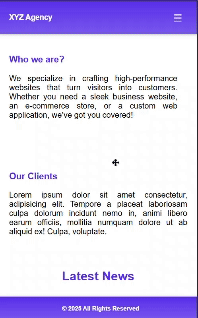

# Task - Create a Multi-Page Simulator

- Create a Multi-Page website and perform navigation between different pages without using javascript.

# Elements Used

- ```id``` - Assigned Unique id for each section (eg. #home, #about etc.).

- Created a navigation links that target these sections using #home, #about, etc. 

- ```:target``` - Pseudo-class to display the corresponding section while hiding others.

- ```z-index:1``` - It is used to control the stacking order of elements on a web page. It determines which elements appear in front of or behind others when they overlap.

- ```opacity:0 and z-index:1``` - By default hiding all sections are hiding except home section.

- ```opacity:1 and z-index:1 ``` - Makes the section visible.


# Outcome

- Desktop View Of Multi-Page Website


- Mobile View Of Multi-Page Website

