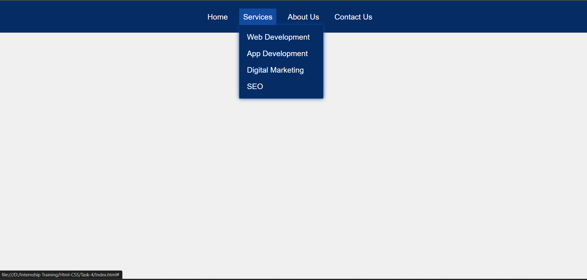

# Task - To Create Pure CSS Dropdown Menu

- Create a Nav Bar with dropdown menu using CSS elements.

# HTML Elements Used

- ```<Nav>``` - To create a nav bar elements.
- ```<ul>``` - To create a unordered list of menus.
- ```<li>``` - To create a list of items for menus.
- ```<a href="#">``` - To create a list items with navigation. Here ```href``` defines the link to navigate a different page.

# CSS Elements Used

- ```flex``` - One-dimensional layout method for arranging the elements in rows and columns.
- ```flex-direction``` - To define the direction of elements defined using flex box.
- ```hover``` - To define a specific set of action to performed when moving the cursor above the element.
- ```position``` - Its a two-dimensional coordinate used to a location relative to an elements box.
- ```transfrom``` - It changes the shape and position of element based on defined coordinate space.
- ```transition``` - It performs a smooth animation over a specified duration of time

# Final Task Output 

- Desktop View of Navbar



- Mobile view of Navbar

