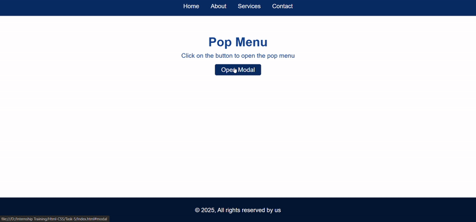

# Task Name: HTML and CSS Pop Menu.
- Creating a Pop menu using a html and css with a ```:target``` and ```:checked``` pseudo-class-to control the modal visibility.

# Elements Used

- ```:target``` - Used to style an elements when it is the target of a fragment identifier.

```
#modal:target{
    opacity:1;
    visibility:visible;
}
```

- ```transform:scale()``` - Used to create a zoom-in effect when the modal opens.

```
.modal-content {
    transform: scale(0.9);
}
#modal:target .modal-content {
    transform: scale(1);
}
```

- ```&times;``` - Represents a multiplication sign (×) and is often used as a close button in modals.


# Output:

- Pop Menu in desktop view.

