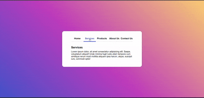

# Task - Create a Tabbed Content Interface

- Create a Tabbed Content Interface without using javascript. Use Radio buttons to serve as a tabs and ```:checked``` pseudo-class to display the content of a tab while hiding other tabs content.

# Elements Used

- ```input[type="radio"]``` - It hides the radio buttons and act as a tab selectors.
- ```for``` - Labels serve as a clickable tabs which is linked to the radio buttons via the for attribute.
- ```:checked``` - Pseudo-class determines which tab's content is displayed.

# Output

