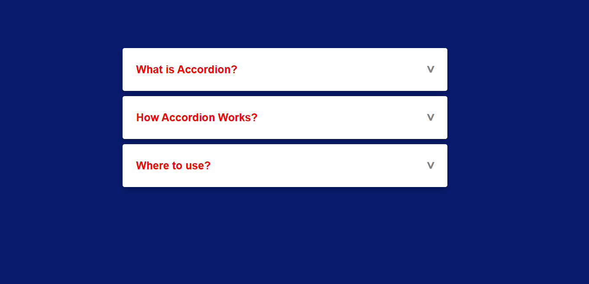
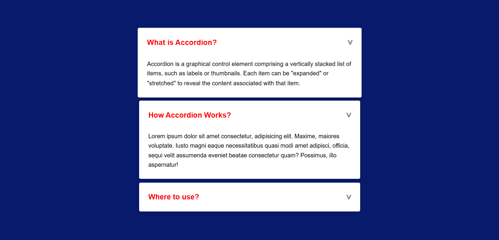

# Task Name - Accordion Component
- Create a Accordion Component by using on html and css, where content sections expand collapse on Click.

# Elements Used
- ```&#x3e;``` - HTML Entity Code for an arrow.
- ```<span>``` - It is a inline container used to apply the specific style to the portion of text.
- ```box-shadow``` - Adds a shadow to elements, creating a 3D effect.
- ```transition: transform 0.2s ease-in-out;``` -  Applies a smooth animation effect when an element changes.
- ```transform: rotate(90deg);``` - Rotates the arrow at 90 degree.
- ```@keyframes``` - To apply a custom animation.
- ```checked``` - Act as a selector for interaction.

# Output





