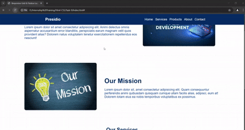
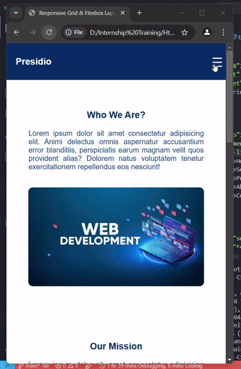

# Task - Complex Responsive Layout with Grid and Flexbox

- Created a simple landing page with complex layout by using a grid and flexbox. Also the page is made responsive by using media query.

# Elements Used

- ```gap``` - Used to add a gap between flex box and grid items.
- ```cursor: pointer;``` - Used in hover and other interactive areas.
- ```z-index: 1000;``` - It helps to handle the elements overlapping issues.

# Outputs

- Desktop View of landing page.



- Mobile view of landing page.



